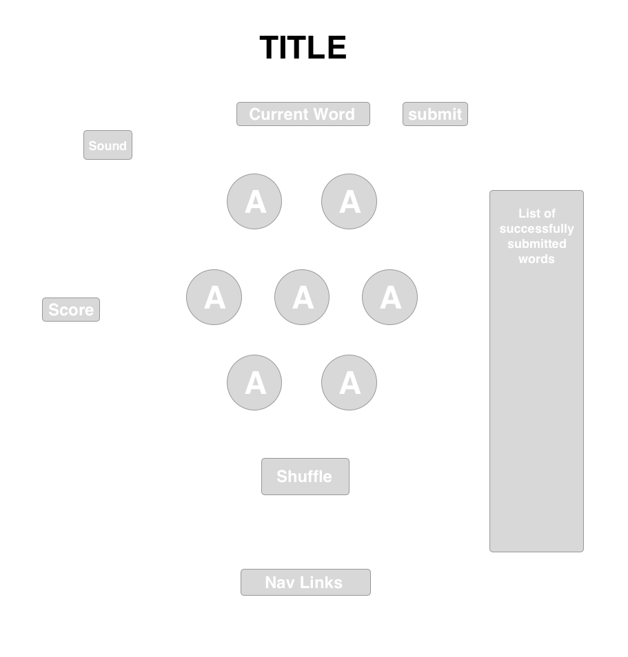

## Overview
Pangram is a game where a player is given 7 letters, and he/she will make as many words as possible.  Words must have at least a length of 4 letters, and there is a required letter player must use.

## Technologies
  * JavaScript
  * npm check-word
  * WordsAPI
  * WebPack
  * HTML5
  
## MVP
  * Player can choose a color theme.
  * Player can end a game and start a new game.
  * Score will be tracked on the board.
  * Player can see words he/she has already created in a modal.
  * Player can shuffle letters to see different arrangements.
  * Sound and visual effects when reaching a certain score or when creating a 7-letter word.
  * Word-of-the-Day feature.
  
## WireFrames

## Bonus Features
  * Timer feature.
  * Player can view a list of all possible words if they choose to end the game.
